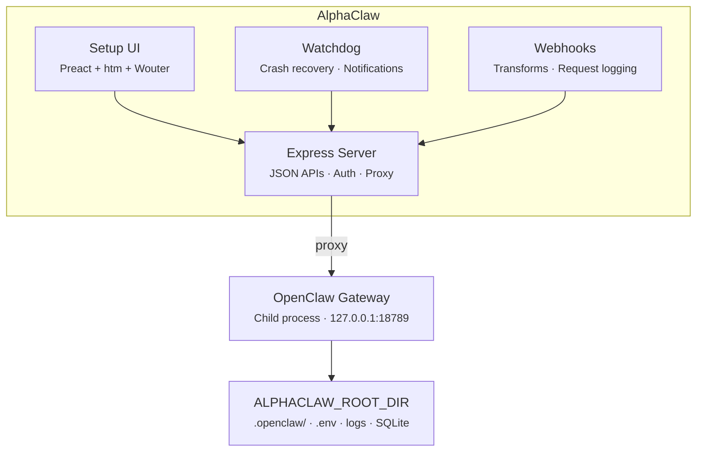

<p align="center">
  
</p>
<h1 align="center">AlphaClaw</h1>
<p align="center">
  <strong>The ultimate OpenClaw harness. Deploy in minutes. Stay running for months.</strong><br>
  <strong>Observability. Reliability. Agent discipline. Zero SSH rescue missions.</strong>
</p>

<p align="center">
  <a href="https://github.com/chrysb/alphaclaw/actions/workflows/ci.yml"></a>
  <a href="https://www.npmjs.com/package/@chrysb/alphaclaw"></a>
  <a href="LICENSE"></a>
</p>

<p align="center">AlphaClaw wraps <a href="https://github.com/openclaw/openclaw">OpenClaw</a> with a convenient setup wizard, self-healing watchdog, Git-backed rollback, and full browser-based observability. Ships with anti-drift prompt hardening to keep your agent disciplined, and simplifies integrations (e.g. Google Workspace, Google Pub/Sub, Telegram Topics, Slack, Discord) so you can manage multiple agents from one UI instead of config files.</p>

<p align="center"><em>First deploy to first message in under five minutes.</em></p>

<p align="center">
  <a href="https://render.com/templates/alphaclaw"></a>
  <a href="https://railway.com/deploy/openclaw-fast-start?referralCode=jcFhp_&utm_medium=integration&utm_source=template&utm_campaign=generic"></a>
  <a href="https://updates.alphaclaw.md/desktop/prod/alphaclaw-mac-latest.dmg"></a>
</p>

<p align="center"><strong>Render sponsors AlphaClaw.</strong> Redeem $50 in Render credits with code <code>RENDER-ALPHACLAW</code>.</p>

> **Platform:** AlphaClaw currently targets Docker/Linux deployments. macOS local development is not yet supported.

## Features

- **Setup UI:** Password-protected web dashboard for onboarding, configuration, and day-to-day management.
- **Guided Onboarding:** Step-by-step setup wizard — model selection, provider credentials, GitHub repo, channel pairing.
- **Multi-Agent Management:** Sidebar-driven agent navigation with create, rename, and delete flows. Per-agent overview cards, channel bindings, and URL-driven agent selection.
- **Agent Chat:** Chat with any agent session right from the sidebar. Sends queue durably and survive page reloads (failed messages get Retry/Discard, and retries reuse the message id so the bridge deduplicates them), Stop reports honestly, interruptions show up inline in the transcript, and the connection reconnects on its own with keepalives on both the browser and gateway sockets.
- **Team Access (beta):** Share one AlphaClaw with named teammates. Each person signs in with their own email and password, OpenClaw attributes messages per person, and a who's-online roster shows presence. Admins invite members with expiring single-use links, assign roles, and disable or remove accounts; members can chat and view status while updates, secrets, terminals, agents, and team management stay admin-only. Requires the OpenClaw 2026.8.1-beta line.
- **Gateway Manager:** Spawns, monitors, restarts, and proxies the OpenClaw gateway as a managed child process. Restarts stream live progress with honest outcomes — measured downtime on success, actual error evidence on failure.
- **Watchdog:** Crash detection, crash-loop recovery, auto-repair (`openclaw doctor --fix`), memory-leak detection that can warn hours before the gateway hits its limit (with strictly opt-in pre-OOM auto-restart), Telegram/Discord/Slack/WhatsApp notifications, and a live interactive terminal for monitoring gateway output directly from the browser.
- **Resource Autotune:** Sizes resource-dependent settings to the container's real capacity (default ON) — gateway heap, agent concurrency, request body limits, SQLite caches, and an advisory backup budget — with a persisted detected → derived → applied ledger, live resize detection, and OOM classification. Opt out per deployment from the Watchdog tab or with the `ALPHACLAW_AUTOTUNE_DISABLED=1` kill-switch.
- **Channel Orchestration:** Telegram, Discord, Slack, ClickClack, and Buzz bot pairing with per-agent channel bindings, credential sync, and a guided wizard for splitting Telegram into multi-threaded topic groups as your usage grows. ClickClack sets up from a single pasted setup code or URL; Buzz installs through a resumable plugin wizard (both need the OpenClaw beta line for their guided flows).
- **Google Workspace:** OAuth integration for Gmail, Calendar, Drive, Docs, Sheets, Tasks, Contacts, and Meet, plus guided Gmail watch setup with Google Pub/Sub topic, subscription, and push endpoint handling.
- **Cron Jobs:** Dedicated cron tab with job management, an interactive rolling calendar, run-history drilldowns, trend analytics, and per-run usage breakdowns.
- **Nodes:** Guided local-node setup for VPS deployments with per-node browser attach checks, reconnect commands, and routing/pairing controls.
- **Webhooks:** Named webhook endpoints with per-hook transform modules, request logging, payload inspection, editable delivery destinations, and OAuth callback support for third-party auth flows.
- **File Explorer:** Browser-based workspace explorer with file visibility, inline edits, diff view, and Git-aware sync for quick fixes without SSH.
- **Prompt Hardening:** Ships anti-drift bootstrap rules as a single merged `hooks/bootstrap/AGENTS.md` injected into your agent's system prompt on every message — enforcing safe practices, commit discipline, and change summaries out of the box on every supported OpenClaw version (existing installs migrate automatically, and the General tab shows whether the rules are actually reaching the agent — a compact status badge, escalating to an actionable card naming the affected file, the true cause, and the fix when hardening is dropped, truncated, or blocked, with a one-click jump into the Doctor's context meter).
- **Git Sync:** Automatic hourly commits of your OpenClaw workspace to GitHub with configurable cron schedule. Combined with prompt hardening, every agent action is version-controlled and auditable.
- **Version Management:** In-place updates for both AlphaClaw and OpenClaw with in-app release notes, changelog review, and one-click apply.
- **Agent Administration:** Optional (off by default) mode that lets the OpenClaw agent drive the same dashboard API the web UI uses through an `alphaclaw admin` CLI, with tiered guardrails, confirm codes for dangerous operations, a rotatable bearer token, and full Watchdog audit logging.
- **Codex OAuth:** Built-in PKCE flow for OpenAI Codex CLI model access.

## Why AlphaClaw

- **Zero to production in one deploy:** Render/Railway templates ship a complete stack — no manual gateway setup.
- **Self-healing:** Watchdog detects crashes, enters repair mode, relaunches the gateway, and notifies you.
- **Everything in the browser:** No SSH, no config files to hand-edit, no CLI required after first deploy.
- **Stays out of the way:** AlphaClaw manages infrastructure; OpenClaw handles the AI.

## No Lock-in. Eject Anytime.

AlphaClaw simply wraps OpenClaw, it's not a dependency. Remove AlphaClaw and your agent keeps running. Nothing proprietary, nothing to migrate.

## Quick Start

### Deploy on Render (recommended)

[](https://render.com/templates/alphaclaw)

Render sponsors AlphaClaw. Use code **`RENDER-ALPHACLAW`** to redeem **$50 in Render credits**. The deployment is maintained in Render's [official AlphaClaw template repository](https://github.com/render-examples/openclaw-render-template).

> **Render sizing:** one AlphaClaw container runs the admin server, the OpenClaw gateway (a second Node.js runtime), up to five `gog` Google Workspace daemons, an hourly git-sync cron, and periodic `npm`/`pnpm` installs during updates. We recommend **at least 2 GB RAM / 1 CPU** (Render `standard` or larger). The `starter` tier (512 MB / 0.5 CPU) can OOM under normal operation and makes every update slower.
>
> **Per-process heap budgets:** if you cap the Node heap, set it on the admin process only (e.g. `node --max-old-space-size=768 bin/alphaclaw.js start` in your start command) rather than via a blanket `NODE_OPTIONS` env var — children would inherit it. AlphaClaw strips memory flags from the gateway's environment so the two processes keep separate budgets (and logs what it stripped). With **resource autotune** (default ON) the gateway's heap is sized automatically from the container's real memory limit, and `GET /api/autotune` reports a recommended admin-process cap for your box (omitted on very small containers, where the honest recommendation is a bigger box). To pin the **gateway's** heap by hand instead, set `ALPHACLAW_GATEWAY_MAX_OLD_SPACE_SIZE=<MB>` (e.g. `8192`) — it applies to the long-running gateway daemon only, never to short-lived `openclaw` CLI calls, and wins over autotune's derived value (the autotune ledger marks that row operator-set). With autotune off and no cap, Node sizes the gateway heap from host RAM (~40% — nearly 50 GB on a 123 GB box).
>
> **Resource autotune runbook:** the Watchdog tab's Autotune card (and `GET /api/autotune`) shows what was detected on this container, what was derived, and what's applied — each row says whether a **gateway** restart or an **AlphaClaw** restart (redeploy from your host dashboard) finishes applying it. Pin a single setting with an override (`alphaclaw admin PUT /api/autotune/settings --data '{"overrides":{"gatewayHeapMb":2048}}'`; `null` clears a key), re-probe after a platform resize with `POST /api/autotune/reapply`, turn it off with the card toggle, or — even mid-crash-loop — set `ALPHACLAW_AUTOTUNE_DISABLED=1` in your platform's environment settings. Disabling restores the built-in (pre-autotune) defaults — a gateway restart (and, for body limits and database caches, an AlphaClaw restart) finishes the revert.
>
> **Health checks:** point your platform health check at `/health` (always 200 while the admin server can serve — a wedged gateway is healed by the watchdog, not container restarts). Operators who want strict gateway readiness gating can point it at `/health/ready` instead (503 while the gateway is down; be aware this restarts the container during gateway recovery, and a **fresh, not-yet-onboarded instance also reports 503** — only switch to `/health/ready` after onboarding completes or the container will restart-loop before you can finish setup). Ops signal: if `eventLoop.p99Ms` in `/api/watchdog/resources` stays above 500ms, check recent gateway restarts and workspace size.

### Other deployment options

[](https://railway.com/deploy/openclaw-fast-start?referralCode=jcFhp_&utm_medium=integration&utm_source=template&utm_campaign=generic)

Set `SETUP_PASSWORD` at deploy time and visit your deployment URL. The welcome wizard handles the rest.

> **Railway users:** after deploying, upgrade to the **Hobby plan** and redeploy to ensure your service has at least **8 GB of RAM**. The Trial plan's memory limit can cause out-of-memory crashes during normal operation.

### Local / Docker

```bash
npm install @chrysb/alphaclaw
npx alphaclaw start
```

Or with Docker:

```dockerfile
FROM node:22-slim
RUN apt-get update && apt-get install -y git curl procps cron tini && rm -rf /var/lib/apt/lists/*
WORKDIR /app
COPY package.json ./
RUN npm install --omit=dev
ENV PATH="/app/node_modules/.bin:$PATH"
ENV ALPHACLAW_ROOT_DIR=/data
EXPOSE 3000
ENTRYPOINT ["/usr/bin/tini", "--"]
CMD ["alphaclaw", "start"]
```

The repo ships this same recipe as the reference [`Dockerfile`](Dockerfile),
and `npm run test:container` runs the full container E2E against an image
built from it (docker required).

## Setup UI

| Tab           | What it manages                                                                                                          |
| ------------- | ------------------------------------------------------------------------------------------------------------------------ |
| **General**   | Gateway status, channel health, pending pairings, Google Workspace, repo sync schedule, prompt-hardening status (compact badge, actionable card in problem states), one-click OpenClaw dashboard (opens signed in) |
| **Browse**    | File explorer for workspace visibility, inline edits, diff review, and Git-backed sync                                   |
| **Usage**     | Token summaries, per-session and per-agent cost and token breakdown with source/agent dimension comparisons              |
| **Cron**      | Cron job management, interactive rolling calendar, run-history drilldowns, trend analytics, and per-run usage breakdowns |
| **Doctor**    | Drift Doctor workspace health review — LLM scan plus deterministic environment checks, model-drift checks (outdated model bindings, invalid model codings, context-limit drift, and skills still steering the agent toward old models), and bridged `openclaw doctor` findings, a context-budget meter against OpenClaw's real injection budget with self-explaining Blocked/Dropped/Truncated chips, opt-in scheduled scans, configurable scan limits, and queued fixes you can dispatch to your agent in the chat you pick |
| **Nodes**     | Guided local-node setup for VPS deployments, per-node browser attach, reconnect commands, and routing/pairing controls   |
| **Team**      | Member accounts, invites, roles, and a who's-online roster (beta) — enable wizard applies the gateway change and verifies login end to end |
| **Watchdog**  | Health monitoring, live status narrative, incident history, optional AI incident overseer, resource autotune card, gateway memory trend + leak-detection settings, auto-repair toggle, notifications, event log, live log tail, interactive terminal |
| **Upgrade**   | OpenClaw versions & release channels — stable/beta/dev catalog, release notes, one-click switch with backup + auto-rollback |
| **Models**    | AI provider credentials (Anthropic, OpenAI, Gemini, Mistral, Voyage, Groq, Deepgram) and model selection                 |
| **Envars**    | Environment variables — view, edit, add — with gateway restart prompts                                                   |
| **Webhooks**  | Webhook endpoints, transform modules, request history, payload inspection, OAuth callbacks, Gmail watch delivery flows   |

## Open Claude Code Launcher

The Monitoring section of the sidebar has an **Open Claude Code** item. Out of the box it opens [claude.ai/code](https://claude.ai/code) in a new tab. Configure it and one click starts a Claude Code session and lands you directly in it — a **local rescue session on the box itself** once you've done its one-time login (see below), or a fresh cloud session via a claude.ai routine.

Routine setup (one time, on your claude.ai account — requires a Pro/Max/Team/Enterprise plan):

1. Create a routine at [claude.ai/code/routines](https://claude.ai/code/routines). Keep its prompt minimal — something like "Await instructions." — because every fire runs the routine's saved prompt as an **autonomous session** (shell access, no approval prompts) that consumes your claude.ai subscription usage.
2. Edit the routine → **Add another trigger** → **API** → **Generate token**, then copy the fire URL and the token (shown once).
3. Paste them into Envars as `CLAUDE_CODE_ROUTINE_URL` (the full URL or just the `trig_…` id) and `CLAUDE_CODE_ROUTINE_TOKEN`. Changes apply immediately — no restart.

Behavior and guardrails:

- The first fire asks for a one-time confirmation; after that it's one click. Cmd/ctrl-click always opens plain claude.ai/code without firing (the escape hatch).
- A small accent dot on the sidebar item shows when the launcher is armed to fire rather than just link out.
- The server enforces the confirmation, a single-flight guard, and a short cooldown (longer after a timeout: the fire API has **no idempotency key**, so a timed-out fire may still have created a billed session — check claude.ai/code before retrying).
- The launcher never sends the token to the browser (status checks are presence-only), the token is excluded from the OpenClaw gateway's child environment, and the fire endpoint is denied to the agent-admin actor. Like every secret in `~/.alphaclaw/.env`, admins can view it in the Envars editor, and a same-host process that can read that file can read it too — the P1 "narrow gatewayEnv secret spread" TODO tracks tightening that class further.
- Routines belong to one claude.ai account: in multi-admin installs, every admin's click fires (and bills) the token owner's account, and the session URL only opens for someone logged into that account.
- `CLAUDE_CODE_ROUTINE_TOKEN` is **not** the same as `ANTHROPIC_TOKEN` (the `claude setup-token`), despite the shared `sk-ant-oat01-` prefix — it is a per-routine trigger credential from the claude.ai UI.

### Local rescue session (preferred when set up)

The launcher's local path opens a Claude Code instance running **on the box itself**: a `claude remote-control` session hosted in detached tmux, reached through its Remote Control URL. Once its login is done, the button prefers this path (the routine stays as the fallback), so you can debug AlphaClaw/OpenClaw from claude.ai/code — or your phone — with hands on the actual machine, even while OpenClaw is down.

- **One-time login.** The Watchdog page's rescue-session card walks you through `claude auth login` in the browser (claude.ai subscription OAuth — Remote Control refuses API keys). Credentials live in `<root>/claude-code-local/home/`, deliberately **outside backups**: after restoring a backup, run the login again.
- **Revocable link.** The card, QR code, launcher, and notifications hand out an AlphaClaw-owned capability link — `<your-alphaclaw>/rescue/<token>` — that redirects to the live session. **Links AlphaClaw distributed stop working on Stop; each new session start mints a new one** (Start on an already-running session returns the existing link — stop first to rotate). An AlphaClaw restart with a still-live session keeps the same link. Honest boundaries: the guarantee does not cover fallback notifications sent with no public base URL configured (those carry the raw claude.ai URL — set `ALPHACLAW_SETUP_URL`), the underlying claude.ai URL disclosed to someone who already followed the redirect remains valid on Anthropic's side (claude.ai-account-gated), and a reverse proxy in front of AlphaClaw may access-log capability paths (inherent to capability URLs — revocation is the mitigation). The link needs the AlphaClaw server up; the card's `tmux … attach` hint is the out-of-band fallback. **Upgrading to this release: links distributed before the upgrade are raw claude.ai URLs — stop + start the rescue session once to cut over to revocable links.**
- **Survives AlphaClaw restarts.** The tmux session outlives the AlphaClaw process; the card shows the rescue link (with a QR code for your phone), a copyable `tmux … attach` hint for shell access, one-click Stop, and a sanitized terminal tail when a spawn fails. Optionally warm a session at boot, or automatically when the watchdog opens an incident — the incident notification carries the link when the session is already running. Each use of the link is recorded as a watchdog operation event (IP + user agent); after an *unexpected* pane death the link dies on the next liveness poll, and a click also triggers a check — that click may still receive the stale redirect to the already-dead session, subsequent clicks 404 (explicit Stop revokes immediately; tmux hosting only — script-hosted sessions detect death instantly on process exit). Both GET and HEAD redirect (HEAD skips the liveness check); a malformed link gets a plain 400. Behind a reverse proxy, set `ALPHACLAW_SETUP_URL` so links and QR codes are built from the validated public origin instead of request headers (origins/subdomains only — path-prefixed proxy deployments like `https://host/alphaclaw` are not supported for rescue links).
- **Permissions.** Sessions default to `acceptEdits`; `bypassPermissions` is opt-in and only ever applies to sessions you start by clicking through the mode-named confirmation — unattended spawns (autostart, incidents) always clamp to `acceptEdits`. Note the session can read box content, including untrusted logs (a prompt-injection surface), and transmits selected content to Anthropic as part of operating Claude Code.
- **Settings.** Five `CLAUDE_CODE_LOCAL_*` keys on the Envars page — enable/kill switch, autostart, permission mode, working directory, incident auto-spawn — all hot-reloaded, no restart. Disabling never kills a live session; stop it from the Watchdog card.

#### State runbook (`local.state` on the status endpoint / Watchdog card)

`<root>` below is `ALPHACLAW_ROOT_DIR` (`/data` in the container, `~/.alphaclaw` otherwise).

| State | Meaning → fix |
| ----- | ------------- |
| `probing` | First background probe hasn't finished (just after boot) → re-check in a few seconds. |
| `disabled` | `CLAUDE_CODE_LOCAL_ENABLED` is 0/false → re-enable in Envars (hot-reload). Disabling never kills a live session — it only blocks new spawns/logins; stop a still-live session from the Watchdog card. |
| `not_installed` | The `claude` CLI is missing → `npm install -g @anthropic-ai/claude-code` (the Docker image ships a pinned copy, so this means a non-Docker install). |
| `needs_login` | No OAuth credential under the rescue HOME → one-time login from the Watchdog card. Credentials live OUTSIDE backups at `<root>/claude-code-local/home/` — after restoring a backup, re-run the login. |
| `login_in_progress` | The guided login is running (10-minute TTL) → finish or cancel it from the card; sessions cannot start meanwhile. |
| `ready` | Installed and logged in, no session → the sidebar button (or Start on the card) spawns one. |
| `starting` | Spawned; waiting up to 60s for the Remote Control URL. |
| `running` | Live; revocable `/rescue/<token>` link (and QR) on the card — dead links mean the session was stopped or replaced (start a new one). Shell attach, last resort when claude.ai is unreachable: `tmux -S <root>/claude-code-local/tmux.sock attach -t alphaclaw-rescue`. |
| `error` | `local.error` carries code + message → view the sanitized tail on the card; Stop clears it, and the next start kills any leftover failed session before spawning fresh. |
| `stopping` | A stop is in flight → transient. |

Post-rollback cleanup: after rolling the feature back (env kill switch or code revert), a live tmux session deliberately survives — clean it up with `tmux -S <root>/claude-code-local/tmux.sock kill-server`. The credentials dir is harmless to leave; the card's Logout removes it beforehand if wanted.

## OpenClaw Release Channels

The **Upgrade** page pins your OpenClaw to a release channel and lets you switch, upgrade, or downgrade between specific builds — entirely from the browser.

| Channel    | What runs                                                                 | Risk                                     |
| ---------- | ------------------------------------------------------------------------- | ---------------------------------------- |
| **Stable** | The exact OpenClaw version AlphaClaw ships and tests against (the default) | Safest — vetted with every AlphaClaw release |
| **Beta**   | Upstream's pre-release train (npm `beta` builds, published every few days) | New features sooner, occasional bugs     |
| **Dev**    | Built from source off OpenClaw's `main` branch, the way its creator runs it | Newest possible; protected by auto-rollback |

How it works:

- **Explicit updates only.** Nothing installs on its own. Pick a version (last 5 stable, last 5 beta, or recent `main` commits), review its release notes, click once. Every restart deterministically re-loads the version you chose — offline, from a persisted copy on your data volume.
- **`npm ls` reporting the `openclaw` dependency as "invalid" is expected while a channel pick is active.** `package.json` keeps the exact stable pin (it is the safety fallback every recovery path boots from), while the applied build is overlaid onto `node_modules/openclaw` at startup — so npm's checker sees a version that doesn't match the declared spec. The boot log prints `running <version> (<channel> channel) over declared pin <pin> — expected…`, and the channel status APIs expose `pinDiverged`/`appliedVersion` so tooling can tell this expected state from real drift (foreign tampering is separately detected and reverted).
- **Backed up before every switch.** AlphaClaw runs `openclaw backup create --verify` first, writing a per-run timestamped archive under `<root>/backups/openclaw/` (the last 3 are retained); downgrades and dev builds are blocked unless the backup verifies (older versions — and the pin you'd roll back to — may not read migrated state). Downgrades and cross-channel switches pause the gateway briefly so the backup captures a consistent state database — the confirm dialog says so — with a retry ladder for vanished-file races when pausing isn't possible.
- **Database compatibility check.** Before an update applies, the target version's own binary verifies it can read snapshots of your state databases; incompatible updates are blocked before anything changes, and rollbacks that can't be verified say so honestly.
- **Settings migration at boot.** After a version change, OpenClaw's own doctor migrates your settings once (keeping a per-version pre-migration backup); downgrades restore the exact settings saved for that version, and the Upgrade page shows the last migration result. The migration is fail-closed: it runs BEFORE the new build's gateway can start, and on failure AlphaClaw reverts to a preflight-proven older build when that is safe — otherwise it holds the gateway with one-click "Retry migration" / "Strip blamed keys and retry" actions (see [docs/upgrade-troubleshooting.md](docs/upgrade-troubleshooting.md)).
- **What's new, per channel.** A curated card highlights each OpenClaw line's changes, with security-default flips called out separately — and those same security changes reappear in the apply confirmation before you commit to a cross-channel switch.
- **Repair.** A dev build that fails mid-update gets a one-click, streamed `openclaw update repair`, recorded in the run timeline like any other update.
- **Auto-rollback.** A freshly switched version gets a 24-hour stabilization window. If it crash-loops, exits with a config error, or stays degraded, AlphaClaw blocklists it, restarts, and boots the last known-good build — then tells you on Telegram/Discord/Slack what happened and why. "Mark as good now" ends the window early once you're satisfied.
- **Dev builds are honest about cost.** The first dev build compiles OpenClaw from source (20-35 minutes measured, 45-minute ceiling, ~5 GB on the data volume, 8 GB RAM recommended) with live build output streamed to the page. Your agent stays up until the final restart.
- **Channel picks persist immediately, but install nothing.** Switching the channel selector saves right away and just changes which catalog you browse; a mismatch banner points out when the running version isn't from the selected channel. Nothing installs until you press Apply.
- **Every update run is auditable.** Each apply gets a durable run record and a redacted, size-capped log that survive the restart (`/api/openclaw/runs`, `/api/openclaw/runs/:id/log`) — the Upgrade page shows exactly what happened even after a crash mid-update.
- **Notifications you can route.** Upgrade and watchdog events go through a durable outbox (retried, re-delivered after restarts) and can be routed to specific admin chats with a preferred channel and fallbacks, instead of broadcasting to every paired conversation.
- **Gateway startup medic (on by default).** If the gateway dies at startup with a fatal configuration error, AlphaClaw fixes it instead of staying down: it removes the config keys the gateway itself rejected (best-effort backup taken first), or runs OpenClaw's `doctor --fix`, then restarts — and for unfamiliar failures it asks the smartest frontier model you have an API key for (Anthropic, OpenAI, or Gemini; evidence is secret-redacted first) to diagnose and choose from a fixed menu of safe remedies. At most two attempts per incident, every action is announced, and you can turn it off on the Upgrade page.
- **Optional AI overseer (off by default).** If you have the Claude Code CLI installed and an Anthropic API key set, you can enable an advisory reviewer: after an update settles, it reads the run record, redacted log tail, and `openclaw doctor` output, and posts a verdict ("looks healthy — consider Mark as good" / "looks broken — consider Roll back"). It's recommend-only — the deterministic auto-rollback stays in charge — and when enabled, redacted upgrade logs and doctor output are sent to the Anthropic API.
- **Beta extras appear when the beta ships them.** On OpenClaw 2026.8.1-beta.1+ the UI gains a session Dashboards link (opens in a new tab already signed in — the authenticated `/gateway/launch` redirect primes the token server-side, so it never enters the page's JavaScript), a "Create verified SQLite backup" button on the Watchdog tab (snapshots the shared state database and every configured agent's database, and verifies each snapshot it created — a backup that can't be verified is reported as a failure, never a success), and a note about secret egress binding — all hidden (and their APIs closed) on older versions.

The stable pin in `package.json` remains the recovery floor: whatever happens, a container restart can always fall back to it.

## Agent Administration

Off by default. When you enable `features.agentAdmin` (Setup UI -> General tab, "Agent Administration" panel, or `PUT /api/alphaclaw/config/features/agent-admin`), the OpenClaw agent can administer the deployment on behalf of admin users. It works through an `alphaclaw admin <METHOD> /api/path` CLI that drives the same dashboard HTTP API the web UI uses, so the server owns all validation and side effects. With the flag off, nothing observable changes.

Enabling it regenerates an `alphaclaw-admin` skill into the agent's workspace (rebuilt at boot, effective on the agent's next session) and adds a pointer stanza to the agent's `TOOLS.md`. Operations are tiered: **safe** reads run freely, **write** operations mutate immediately, **restart** operations apply but need a gateway restart, **dangerous** operations require a one-time confirm code delivered to a configured admin channel, and **denied** operations stay operator-only. Every agent mutation is written to the Watchdog event log, and admins are notified of restart-level and dangerous changes. A bearer token (mode `0600`, kept in the managed state dir, never git-synced) authenticates the CLI; rotate it from the panel.

The CLI takes the request body inline or from stdin, plus optional flags for confirm codes, a compact summary, and JSON output:

```bash
# safe: reads run freely
alphaclaw admin GET /api/openclaw/runs --json

# write: applies immediately, body from stdin
echo '{"autoRepair":true}' | alphaclaw admin PUT /api/watchdog/settings --data-stdin

# dangerous: one-time confirm code, delivered to your admin channel
alphaclaw admin DELETE /api/agents/legacy-bot --confirm ABCD-EFGH
```

**Honest framing (same convention as team mode).** This is not a security boundary against the agent. The agent already holds these credentials through its gateway environment. Agent Administration exists to keep secrets out of chat transcripts, attribute actions for audit, enable revocation, and add tiered guardrails and structured errors.
## Team Access (beta)

The **Team** tab turns a single-password AlphaClaw into a multi-member workspace. It needs the OpenClaw 2026.8.1-beta line (the tab shows "switch to the beta channel to try it" on older builds).

How it works:

- **Real member accounts.** Each teammate signs in with their own email and password. OpenClaw sees who's who — messages are attributed per person, everyone gets their own profile, and the roster shows who's online.
- **Trusted-proxy identity.** With team access on, the gateway switches from shared-token to trusted-proxy auth: AlphaClaw injects the signed-in member's email on every gateway request (HTTP, WebSocket, and webhook paths) and strips client-supplied forwarding headers so identity can't be spoofed.
- **Invites and roles.** Admins invite members with expiring single-use links, set roles, and disable or remove accounts — sessions and gateway authority end together, and the last admin can never be demoted. Invite acceptance is transactional (a failed signup doesn't burn the link).
- **Permission boundary.** Members can chat and view status. Updates, secrets, terminals, agents, webhooks, and team management stay admin-only — enforced on every API route, WebSocket, and OAuth callback, with a role-aware nav that hides admin pages.
- **Safe enable + rollback.** The enable wizard explains the security boundary up front, applies the gateway change, restarts, verifies the login handshake end to end, and restores the previous setup automatically if the check fails. Optional lockdown turns off shared-password login once your own account works (a break-glass env var is included).
- **Off means off.** Turning team access off fully ends member access: member sessions and logins stop, and existing shared-password sessions end the moment shared-password login is disabled.

Team endpoints live under `/api/team` (`enable`, `disable`, `invites`, `members`, `presence`); all mutations are admin-only.

## CLI

| Command                                                    | Description                                   |
| ---------------------------------------------------------- | --------------------------------------------- |
| `alphaclaw start`                                          | Start the server (Setup UI + gateway manager) |
| `alphaclaw git-sync -m "message"`                          | Commit and push the OpenClaw workspace        |
| `alphaclaw doctor finding complete`                        | Mark a queued Doctor finding fixed after verification |
| `alphaclaw telegram topic add --thread <id> --name <text>` | Register a Telegram topic mapping             |
| `alphaclaw telegram topic create --group <id> --name <text>` | Create a Telegram forum topic and register it |
| `alphaclaw telegram topics list`                           | List registered, discovered, and stale topics |
| `alphaclaw admin <METHOD> /api/path`                       | Agent-admin CLI: drive the dashboard API (needs `features.agentAdmin`) |
| `alphaclaw admin manifest`                                 | Print the agent-admin operation catalog       |
| `alphaclaw version`                                        | Print version                                 |
| `alphaclaw help`                                           | Show help                                     |

## Architecture



## Watchdog

The built-in watchdog monitors gateway health and recovers from failures automatically.

| Capability               | Details                                                                |
| ------------------------ | ---------------------------------------------------------------------- |
| **Health checks**        | Periodic HTTP probes of the gateway's `/health` and `/readyz` (120s cadence; degraded retries back off 5s→10s→20s→30s) |
| **Crash detection**      | Gateway exit events plus an always-on 10s TCP port watcher, with immediate re-checks after every restart/repair |
| **Crash-loop detection** | Threshold-based (default: 3 crashes in 300s)                           |
| **Auto-repair**          | Runs `openclaw doctor --fix --yes`, relaunches gateway                 |
| **Restart handoff**      | OpenClaw-requested restarts (config writes, `/restart`, plugin changes) are consumed as a verified handoff and relaunched promptly without crash accounting — rate-braked at 5 handoff relaunches per hour, after which the normal crash flow takes over (OpenClaw 2026.8.1-beta) |
| **Live narration**       | Plain-language "what is happening / why / what happens next" with live countdowns (backoff, grace windows, the 10-min rollback clock) and honest suppression chips |
| **Incident history**     | Persisted, grouped incidents (open → resolved/abandoned) with humanized event timelines, plus the raw SQLite event feed |
| **Incident overseer**    | Optional (default off): a local Claude Code read of what is happening — "Review current situation" works in any watchdog state (current status, the live incident, recent logs with their real coverage, doctor output) and each settled incident is reviewed automatically; advisory verdict + suggested next action, deterministic recovery stays in charge. When enabled, redacted incident evidence and recent logs are sent to the Anthropic API |
| **Resize & OOM awareness** | Detects live container resizes on the watchdog tick (event + notification + retune) and classifies gateway heap-OOM vs container-OOM exits as distinct events with machine-derived remediation |
| **Memory-leak detection** | Default on: samples the gateway's memory (whole process tree) once a minute and confirms a leak with a noise-resistant trend test — one calm notification per episode with projected time to the limit, a distinct alert if it turns critical, a live trend row on the Resources card, and a Drift Doctor finding with a guided fix runbook. Disable from Watchdog → Settings |
| **Pre-OOM auto-restart** | Strictly opt-in (default off): when a confirmed leak turns critical, attempts a graceful gateway restart before the crash — through the same lifecycle lock and interlocks as a manual restart, never during an update's stabilization window, capped at 2 restarts per 24 hours. Arming it via the agent-admin CLI requires an operator confirm |
| **Notifications**        | Telegram, Discord, Slack, and WhatsApp alerts for crashes, repairs, recovery, automatic fixes, and memory-leak warnings (one per episode, plus a distinct critical alert), with links to the Watchdog page (the optional overseer's verdict notification deep-links to the exact incident) — plus a Verbose/Important-only toggle that mutes informational notices without hiding problems |
| **Event log**            | SQLite-backed incident + event history with API and UI access          |

## Environment Variables

| Variable                          | Required | Description                                        |
| --------------------------------- | -------- | -------------------------------------------------- |
| `SETUP_PASSWORD`                  | Yes      | Password for the Setup UI                          |
| `OPENCLAW_GATEWAY_TOKEN`          | Auto     | Gateway auth token (auto-generated if unset)       |
| `GITHUB_TOKEN`                    | Yes      | GitHub PAT for workspace repo; also authenticates Upgrade-page release-catalog reads (avoids anonymous GitHub API rate limits) |
| `GITHUB_WORKSPACE_REPO`           | Yes      | GitHub repo for workspace sync (e.g. `owner/repo`) |
| `TELEGRAM_BOT_TOKEN`              | Optional | Telegram bot token                                 |
| `DISCORD_BOT_TOKEN`               | Optional | Discord bot token                                  |
| `SLACK_BOT_TOKEN`                 | Optional | Slack bot token (Socket Mode)                      |
| `WATCHDOG_AUTO_REPAIR`            | Optional | Enable auto-repair on crash (`true`/`false`)       |
| `CLAUDE_CODE_ROUTINE_URL`         | Optional | Claude Code routine fire URL (or `trig_…` id) from claude.ai/code/routines — powers the sidebar launcher |
| `CLAUDE_CODE_ROUTINE_TOKEN`       | Optional | Per-routine API-trigger token (`sk-ant-oat01-…`); the launcher keeps it server-side and out of the gateway child env |
| `WATCHDOG_NOTIFICATIONS_DISABLED` | Optional | Disable watchdog notifications (`true`/`false`). Deliberate exemptions that still deliver: the settings-card Test button, agent-admin audit notices, and the boot webhook |
| `WATCHDOG_NOTIFICATIONS_QUIET`    | Optional | Important-only notifications (`true` = suppress informational/green notices; absent = verbose ON). Note: a platform-level env var applies only until the first dashboard save writes the key into `.env` — from then on (including after restarts) the `.env` value wins for all watchdog toggles |
| `ALPHACLAW_NOTIFY_WEBHOOK_URL`    | Optional | Extra out-of-band notification channel: watchdog/upgrade alerts are also POSTed here as `{"text": ...}` JSON — delivered even straight from the boot process when no server is up |
| `PORT`                            | Optional | Server port (default `3000`)                       |
| `ALPHACLAW_ROOT_DIR`              | Optional | Data directory (default `/data`)                   |
| `ALPHACLAW_SKIP_SYSTEM_CRON_INSTALL` | Optional | Skip writes to `/etc/cron.d` while keeping cron config (`true`/`false`); the managed hourly script still exits when sync is disabled |
| `ALPHACLAW_GIT_SHIM_PATH`         | Optional | Install the managed git auth shim at this path and prepend its directory to runtime `PATH` (default `/usr/local/bin/git`) |
| `ALPHACLAW_GIT_ASKPASS_PATH`      | Optional | Install the git askpass helper at this path (default `$TMPDIR/alphaclaw-git-askpass.sh`) |
| `ALPHACLAW_AUTOTUNE_DISABLED`     | Optional | Kill-switch: set `1` to disable resource autotune and restore built-in defaults — works mid-crash-loop from your platform's environment settings |
| `ALPHACLAW_GATEWAY_ENV_PASSTHROUGH` | Optional | Extra env keys (or `PREFIX*` globs, comma/space separated) to pass to the OpenClaw gateway/CLI children beyond the built-in allowlist. Internal secrets (`SETUP_PASSWORD`, etc.) can never be passed this way — the deny list always wins. Read from the deployment environment only. |
| `ALPHACLAW_GATEWAY_ENV_UNRESTRICTED` | Optional | Break-glass: set `1` to restore the legacy full-`process.env` spread to the gateway child (minus the absolute deny list). Deprecated; deployment env only. Use only if a needed var is being withheld and the passthrough list is impractical, then report it. |
| `GATEWAY_RESTART_READY_TIMEOUT`   | Optional | Seconds a gateway restart waits for the port to answer before failing (default `300`, clamped `30`–`480`). Raise on slow boxes with many plugins — the wait returns the instant the gateway is up, so a generous value costs nothing on healthy restarts. Read at process start (restart AlphaClaw to change); deployment env only — never honored from `.env`. |
| `WATCHDOG_CHECK_INTERVAL`         | Optional | Seconds between regular gateway health probes (default `120`, clamped `30`–`3600`). Read at process start (restart AlphaClaw to change); deployment env only — never honored from `.env`. |
| `WATCHDOG_DEGRADED_CHECK_INTERVAL` | Optional | First degraded retry delay in seconds; each further retry doubles it (default `5`, clamped `2`–`120`). Read at process start (restart AlphaClaw to change); deployment env only — never honored from `.env`. |
| `WATCHDOG_DEGRADED_CHECK_MAX_INTERVAL` | Optional | Cap for the degraded retry delay in seconds (default `30`, clamped `5`–`120`, never below `WATCHDOG_DEGRADED_CHECK_INTERVAL`). Read at process start (restart AlphaClaw to change); deployment env only — never honored from `.env`. |
| `UV_THREADPOOL_SIZE`              | Optional | An operator-set value wins over autotune's derived I/O thread-pool size; the autotune ledger marks that row `manual` |
| `OPENCLAW_DOCTOR_MIGRATION_TIMEOUT` | Optional | Base settings-migration budget in seconds (default 10 min). The budget scales with state-DB size up to a 30-min cap; an explicit value also raises the cap. |
| `OPENCLAW_MIGRATION_GATE`         | Optional | Set `off` to disable the fail-closed settings-migration gate — a failed migration then holds the gateway instead of reverting to an older build |
| `OPENCLAW_FORWARD_RECOVERY`       | Optional | Set `off` to disable forward recovery (the one-shot move to a newer blocklisted build when the stable pin itself can't boot the migrated state) |
| `TRUST_PROXY_HOPS`                | Optional | Trust proxy hop count for correct client IP        |
| `REMOTE_MCP_URL`                  | Optional | Upstream remote MCP server URL. When set together with `REMOTE_MCP_API_TOKEN`, AlphaClaw writes a managed `mcp.servers.<name>` entry to `openclaw.json` on every gateway start. |
| `REMOTE_MCP_API_TOKEN`            | Optional | Bearer token for the remote MCP server. Persisted in `openclaw.json` as the `${REMOTE_MCP_API_TOKEN}` reference, never as plaintext. |
| `REMOTE_MCP_NAME`                 | Optional | Key under `mcp.servers.<name>`. Defaults to `remote`. Set it to label the entry (e.g. `sure`, `notion`). |
| `REMOTE_MCP_PROXY_URL`            | Optional | When set, OpenClaw connects here instead of `REMOTE_MCP_URL`. Intended for a same-host scanning proxy (e.g. `pipelock mcp proxy --listen <REMOTE_MCP_PROXY_URL> --upstream <REMOTE_MCP_URL>`). Implementation is proxy-agnostic. |

## OpenAI-compatible `/v1` proxy

AlphaClaw can expose an OpenAI-compatible API surface on the same public port as the Setup UI. It is disabled by default. Enable it from the Setup UI under General -> Features -> API; the setting is persisted in `alphaclaw.json` in the OpenClaw repo so workspace sync can commit the change.

| Path                            | Method  | Notes                                                              |
| ------------------------------- | ------- | ------------------------------------------------------------------ |
| `/v1/chat/completions`          | POST    | Streams when `stream: true`. Use `model: "openclaw/default"` or `openclaw/<agentId>`. |
| `/v1/responses`                 | POST    | OpenClaw's `/v1/responses` surface (enabled together with chat completions). |
| `/v1/embeddings`                | POST    | Routes to OpenClaw's embeddings endpoint.                          |
| `/v1/models`, `/v1/models/<id>` | GET     | Lists OpenClaw agent targets.                                      |

When enabled, the proxy forwards requests to the loopback OpenClaw gateway. AlphaClaw requires `Authorization: Bearer <OPENCLAW_GATEWAY_TOKEN>` and rejects requests when the gateway token is missing or does not match before forwarding to OpenClaw. Failed bearer-token attempts are rate-limited before proxying. The setup-UI cookie is stripped before forwarding, hop-by-hop response headers are not passed through, and `/v1` JSON request bodies are accepted up to a machine-derived limit: 20 MB on small containers, scaling with resource autotune to 32/48/64 MB on medium/large/xl tiers (overridable via `openAiCompatBodyLimitMb`, clamped to ~10% of container memory — parsing a large body can transiently need several times its size in heap). When disabled or missing from `alphaclaw.json`, `/v1` requests return 404.

**Security boundary (important).** OpenClaw treats `/v1/chat/completions` as a full operator-access surface. A caller with a valid `OPENCLAW_GATEWAY_TOKEN` can run any tool the configured agent profile allows. Treat this token like an owner credential:

- Use this surface only for trusted server-to-server callers (for example, a self-hosted app that needs OpenClaw as its external assistant).
- Do not hand the gateway token to end-user clients.
- If your front door is public (Render, Fly, fly-style PaaS), make sure `SETUP_PASSWORD` is strong and that the gateway token is held by exactly one trusted backend.

When `REMOTE_MCP_URL` + `REMOTE_MCP_API_TOKEN` are set, AlphaClaw also registers an `mcp.servers.<REMOTE_MCP_NAME>` block (default key `remote`) in `openclaw.json` so the agent can call back into that remote MCP server. Set `REMOTE_MCP_PROXY_URL` to route those callbacks through a same-host scanning proxy (for example a Pipelock MCP reverse proxy running in the same container).

## Security Notes

AlphaClaw is a convenience wrapper — it intentionally trades some of OpenClaw's default hardening for ease of setup. You should understand what's different:

| Area                    | What AlphaClaw does                                                                                                                   | Trade-off                                                                                              |
| ----------------------- | ------------------------------------------------------------------------------------------------------------------------------------- | ------------------------------------------------------------------------------------------------------ |
| **Setup password**      | All gateway access is gated behind a single `SETUP_PASSWORD`. Brute-force protection is built in (exponential backoff lockout).       | Simpler than OpenClaw's pairing code flow, but the password must be strong.                            |
| **One-click pairing**   | Channel pairings (Telegram/Discord/Slack) can be approved from the Setup UI instead of the CLI.                                       | No terminal access required, but anyone with the setup password can approve pairings.                  |
| **Auto CLI approval**   | The first CLI device pairing is auto-approved so you can connect without a second screen. Subsequent requests appear in the UI.       | Removes the manual pairing step for the initial CLI connection.                                        |
| **Query-string tokens** | Webhook URLs support `?token=<WEBHOOK_TOKEN>` for providers that don't support `Authorization` headers. Warnings are shown in the UI. | Tokens may appear in server logs and referrer headers. Use header auth when your provider supports it. |
| **Gateway token**       | `OPENCLAW_GATEWAY_TOKEN` is auto-generated and injected into the environment so the proxy can authenticate with the gateway.          | The token lives in the `.env` file on the server — standard for managed deployments but worth noting.  |

If you need OpenClaw's full security posture (manual pairing codes, no query-string tokens, no auto-approval), use OpenClaw directly without AlphaClaw.

## Development

Release history lives in [CHANGELOG.md](CHANGELOG.md); contributor setup and
test tiers are in [CONTRIBUTING.md](CONTRIBUTING.md); open work is tracked in
[TODOS.md](TODOS.md); design documents (Agent Administration, chat reliability, gateway state
model, the OpenClaw context contract, Telegram topics discovery) live in
[docs/designs/](docs/designs/);
the operator runbook for upgrade failure states (held gateways, blocked
restores, rollback fencing) is
[docs/upgrade-troubleshooting.md](docs/upgrade-troubleshooting.md);
architecture notes and conventions for coding agents are in
[AGENTS.md](AGENTS.md).

```bash
npm install
npm run build:ui        # Generate Setup UI bundle, Tailwind CSS, and vendor CSS (required for local runs from a git checkout)
npm test                # Full suite (hermetic — no network)
npm run test:watchdog   # Watchdog-focused suite
npm run test:watch      # Watch mode
npm run test:coverage   # Coverage report

# Live e2e tiers (opt-in; hit the REAL npm registry / GitHub API and install
# real OpenClaw releases — catch upstream drift the hermetic suite can't):
npm run test:live       # catalog + real stable/beta package applies, plus a
                        # real-gateway memory-leak e2e against the newest beta
                        # (network)
npm run test:live:dev   # dev-channel source build only (20-35 min, ~5 GB disk);
                        # does not re-run the catalog/apply tiers above
npm run test:container  # full production-container journey: builds the image,
                        # boots a real stable gateway, drives a stable→beta
                        # upgrade through headless Chromium, proves restart
                        # durability (~25-40 min; needs docker + network)
npm run test:ui         # Browser UI smoke of the Upgrade page: real server +
                        # headless Chromium asserting the rendered DOM (opt-in;
                        # needs network for the version catalog; self-skips
                        # unless a browse CLI is present — set BROWSE_BIN)
npm run test:ui:time    # Browser smoke of UI time formatting: real server +
                        # headless Chromium asserting rendered timestamps against
                        # expectations the browser itself computes with the same
                        # Intl presets, so it passes in any locale/timezone
                        # (opt-in; self-skips without a browse CLI — set BROWSE_BIN)
npm run test:ui:claude-code   # Browser smoke of the Open Claude Code launcher
                        # (opt-in; same real-server + Chromium harness)
npm run test:live:claude-code # Fires the REAL configured routine end-to-end —
                        # BILLS one claude.ai session; needs CLAUDE_CODE_ROUTINE_URL
                        # / CLAUDE_CODE_ROUTINE_TOKEN + CLAUDE_CODE_LIVE_FIRE=1
```

The live tiers also run in CI on a schedule (`.github/workflows/live-e2e.yml`):
nightly for catalog + package applies, weekly (or manually via
`workflow_dispatch`) for the dev source build. A live-tier failure usually
means upstream OpenClaw changed something the channel feature depends on
(dist-tags, prerelease naming, engines, updater JSON, dist layout) — not that
this repo regressed.

**Requirements:** Node.js ≥ 22.22.3 on Node 22, ≥ 24.15.0 on Node 24, or ≥ 25.9.0

## Official Website

[alphaclaw.md](https://alphaclaw.md) is the official AlphaClaw website.

## License

MIT
