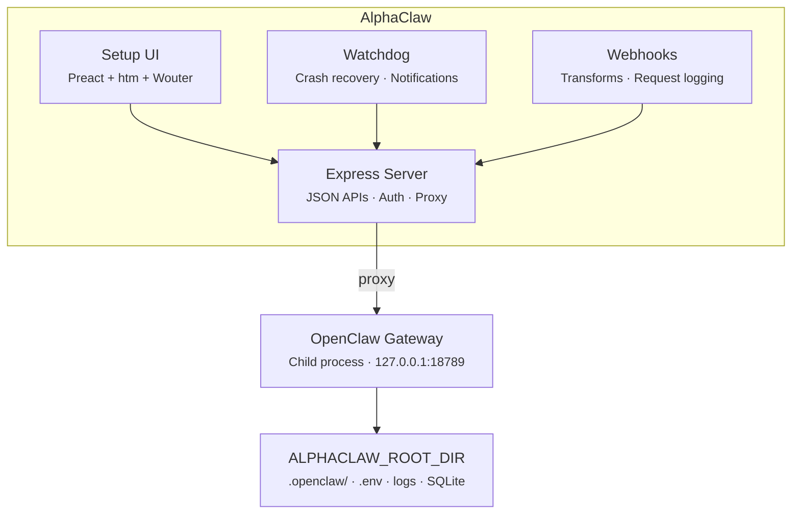

<p align="center">
  
</p>
<h1 align="center">AlphaClaw</h1>
<p align="center">
  <strong>The ultimate OpenClaw harness. Deploy in minutes. Stay running for months.</strong><br>
  <strong>Observability. Reliability. Agent discipline. Zero SSH rescue missions.</strong>
</p>

<p align="center">
  <a href="https://github.com/chrysb/alphaclaw/actions/workflows/ci.yml"></a>
  <a href="https://www.npmjs.com/package/@chrysb/alphaclaw"></a>
  <a href="LICENSE"></a>
</p>

<p align="center">AlphaClaw wraps <a href="https://github.com/openclaw/openclaw">OpenClaw</a> with a convenient setup wizard, self-healing watchdog, Git-backed rollback, and full browser-based observability. Ships with anti-drift prompt hardening to keep your agent disciplined, and simplifies integrations (e.g. Google Workspace, Google Pub/Sub, Telegram Topics, Slack, Discord) so you can manage multiple agents from one UI instead of config files.</p>

<p align="center"><em>First deploy to first message in under five minutes.</em></p>

<p align="center">
  <a href="https://render.com/templates/alphaclaw"></a>
  <a href="https://railway.com/deploy/openclaw-fast-start?referralCode=jcFhp_&utm_medium=integration&utm_source=template&utm_campaign=generic"></a>
  <a href="https://updates.alphaclaw.md/desktop/prod/alphaclaw-mac-latest.dmg"></a>
</p>

<p align="center"><strong>Render sponsors AlphaClaw.</strong> Redeem $50 in Render credits with code <code>RENDER-ALPHACLAW</code>.</p>

> **Platform:** AlphaClaw currently targets Docker/Linux deployments. macOS local development is not yet supported.

## Features

- **Setup UI:** Password-protected web dashboard for onboarding, configuration, and day-to-day management.
- **Guided Onboarding:** Step-by-step setup wizard — model selection, provider credentials, GitHub repo, channel pairing.
- **Multi-Agent Management:** Sidebar-driven agent navigation with create, rename, and delete flows. Per-agent overview cards, channel bindings, and URL-driven agent selection.
- **Gateway Manager:** Spawns, monitors, restarts, and proxies the OpenClaw gateway as a managed child process.
- **Watchdog:** Crash detection, crash-loop recovery, auto-repair (`openclaw doctor --fix`), Telegram/Discord/Slack notifications, and a live interactive terminal for monitoring gateway output directly from the browser.
- **Channel Orchestration:** Telegram, Discord, and Slack bot pairing with per-agent channel bindings, credential sync, and a guided wizard for splitting Telegram into multi-threaded topic groups as your usage grows.
- **Google Workspace:** OAuth integration for Gmail, Calendar, Drive, Docs, Sheets, Tasks, Contacts, and Meet, plus guided Gmail watch setup with Google Pub/Sub topic, subscription, and push endpoint handling.
- **Cron Jobs:** Dedicated cron tab with job management, an interactive rolling calendar, run-history drilldowns, trend analytics, and per-run usage breakdowns.
- **Nodes:** Guided local-node setup for VPS deployments with per-node browser attach checks, reconnect commands, and routing/pairing controls.
- **Webhooks:** Named webhook endpoints with per-hook transform modules, request logging, payload inspection, editable delivery destinations, and OAuth callback support for third-party auth flows.
- **File Explorer:** Browser-based workspace explorer with file visibility, inline edits, diff view, and Git-aware sync for quick fixes without SSH.
- **Prompt Hardening:** Ships anti-drift bootstrap prompts (`AGENTS.md`, `TOOLS.md`) injected into your agent's system prompt on every message — enforcing safe practices, commit discipline, and change summaries out of the box.
- **Git Sync:** Automatic hourly commits of your OpenClaw workspace to GitHub with configurable cron schedule. Combined with prompt hardening, every agent action is version-controlled and auditable.
- **Version Management:** In-place updates for both AlphaClaw and OpenClaw with in-app release notes, changelog review, and one-click apply.
- **Codex OAuth:** Built-in PKCE flow for OpenAI Codex CLI model access.

## Why AlphaClaw

- **Zero to production in one deploy:** Render/Railway templates ship a complete stack — no manual gateway setup.
- **Self-healing:** Watchdog detects crashes, enters repair mode, relaunches the gateway, and notifies you.
- **Everything in the browser:** No SSH, no config files to hand-edit, no CLI required after first deploy.
- **Stays out of the way:** AlphaClaw manages infrastructure; OpenClaw handles the AI.

## No Lock-in. Eject Anytime.

AlphaClaw simply wraps OpenClaw, it's not a dependency. Remove AlphaClaw and your agent keeps running. Nothing proprietary, nothing to migrate.

## Quick Start

### Deploy on Render (recommended)

[](https://render.com/templates/alphaclaw)

Render sponsors AlphaClaw. Use code **`RENDER-ALPHACLAW`** to redeem **$50 in Render credits**. The deployment is maintained in Render's [official AlphaClaw template repository](https://github.com/render-examples/openclaw-render-template).

> **Render sizing:** one AlphaClaw container runs the admin server, the OpenClaw gateway (a second Node.js runtime), up to five `gog` Google Workspace daemons, an hourly git-sync cron, and periodic `npm`/`pnpm` installs during updates. We recommend **at least 2 GB RAM / 1 CPU** (Render `standard` or larger). The `starter` tier (512 MB / 0.5 CPU) can OOM under normal operation and makes every update slower.
>
> **Per-process heap budgets:** if you cap the Node heap, set it on the admin process only (e.g. `node --max-old-space-size=768 bin/alphaclaw.js start` in your start command) rather than via a blanket `NODE_OPTIONS` env var — children would inherit it. AlphaClaw already strips memory flags from the gateway's environment so the two processes keep separate budgets.
>
> **Health checks:** point your platform health check at `/health` (always 200 while the admin server can serve — a wedged gateway is healed by the watchdog, not container restarts). Operators who want strict gateway readiness gating can point it at `/health/ready` instead (503 while the gateway is down; be aware this restarts the container during gateway recovery). Ops signal: if `eventLoop.p99Ms` in `/api/watchdog/resources` stays above 500ms, check recent gateway restarts and workspace size.

### Other deployment options

[](https://railway.com/deploy/openclaw-fast-start?referralCode=jcFhp_&utm_medium=integration&utm_source=template&utm_campaign=generic)

Set `SETUP_PASSWORD` at deploy time and visit your deployment URL. The welcome wizard handles the rest.

> **Railway users:** after deploying, upgrade to the **Hobby plan** and redeploy to ensure your service has at least **8 GB of RAM**. The Trial plan's memory limit can cause out-of-memory crashes during normal operation.

### Local / Docker

```bash
npm install @chrysb/alphaclaw
npx alphaclaw start
```

Or with Docker:

```dockerfile
FROM node:22-slim
RUN apt-get update && apt-get install -y git curl procps cron tini && rm -rf /var/lib/apt/lists/*
WORKDIR /app
COPY package.json ./
RUN npm install --omit=dev
ENV PATH="/app/node_modules/.bin:$PATH"
ENV ALPHACLAW_ROOT_DIR=/data
EXPOSE 3000
ENTRYPOINT ["/usr/bin/tini", "--"]
CMD ["alphaclaw", "start"]
```

## Setup UI

| Tab           | What it manages                                                                                                          |
| ------------- | ------------------------------------------------------------------------------------------------------------------------ |
| **General**   | Gateway status, channel health, pending pairings, Google Workspace, repo sync schedule, OpenClaw dashboard               |
| **Browse**    | File explorer for workspace visibility, inline edits, diff review, and Git-backed sync                                   |
| **Usage**     | Token summaries, per-session and per-agent cost and token breakdown with source/agent dimension comparisons              |
| **Cron**      | Cron job management, interactive rolling calendar, run-history drilldowns, trend analytics, and per-run usage breakdowns |
| **Doctor**    | Drift Doctor workspace health review — scans for guidance drift, misplaced instructions, redundant docs, and queued fixes |
| **Nodes**     | Guided local-node setup for VPS deployments, per-node browser attach, reconnect commands, and routing/pairing controls   |
| **Watchdog**  | Health monitoring, crash-loop status, auto-repair toggle, notifications, event log, live log tail, interactive terminal  |
| **Upgrade**   | OpenClaw versions & release channels — stable/beta/dev catalog, release notes, one-click switch with backup + auto-rollback |
| **Models**    | AI provider credentials (Anthropic, OpenAI, Gemini, Mistral, Voyage, Groq, Deepgram) and model selection                 |
| **Envars**    | Environment variables — view, edit, add — with gateway restart prompts                                                   |
| **Webhooks**  | Webhook endpoints, transform modules, request history, payload inspection, OAuth callbacks, Gmail watch delivery flows   |

## OpenClaw Release Channels

The **Upgrade** page pins your OpenClaw to a release channel and lets you switch, upgrade, or downgrade between specific builds — entirely from the browser.

| Channel    | What runs                                                                 | Risk                                     |
| ---------- | ------------------------------------------------------------------------- | ---------------------------------------- |
| **Stable** | The exact OpenClaw version AlphaClaw ships and tests against (the default) | Safest — vetted with every AlphaClaw release |
| **Beta**   | Upstream's pre-release train (npm `beta` builds, published every few days) | New features sooner, occasional bugs     |
| **Dev**    | Built from source off OpenClaw's `main` branch, the way its creator runs it | Newest possible; protected by auto-rollback |

How it works:

- **Explicit updates only.** Nothing installs on its own. Pick a version (last 5 stable, last 5 beta, or recent `main` commits), review its release notes, click once. Every restart deterministically re-loads the version you chose — offline, from a persisted copy on your data volume.
- **Backed up before every switch.** AlphaClaw runs `openclaw backup create --verify` first; downgrades and dev builds are blocked unless the backup verifies (older versions — and the pin you'd roll back to — may not read migrated state).
- **Auto-rollback.** A freshly switched version gets a 24-hour stabilization window. If it crash-loops, exits with a config error, or stays degraded, AlphaClaw blocklists it, restarts, and boots the last known-good build — then tells you on Telegram/Discord/Slack what happened and why. "Mark as good now" ends the window early once you're satisfied.
- **Dev builds are honest about cost.** The first dev build compiles OpenClaw from source (20-35 minutes measured, 45-minute ceiling, ~5 GB on the data volume, 8 GB RAM recommended) with live build output streamed to the page. Your agent stays up until the final restart.
- **Channel picks persist immediately, but install nothing.** Switching the channel selector saves right away and just changes which catalog you browse; a mismatch banner points out when the running version isn't from the selected channel. Nothing installs until you press Apply.
- **Every update run is auditable.** Each apply gets a durable run record and a redacted, size-capped log that survive the restart (`/api/openclaw/runs`, `/api/openclaw/runs/:id/log`) — the Upgrade page shows exactly what happened even after a crash mid-update.
- **Notifications you can route.** Upgrade and watchdog events go through a durable outbox (retried, re-delivered after restarts) and can be routed to specific admin chats with a preferred channel and fallbacks, instead of broadcasting to every paired conversation.
- **Optional AI overseer (off by default).** If you have the Claude Code CLI installed and an Anthropic API key set, you can enable an advisory reviewer: after an update settles, it reads the run record, redacted log tail, and `openclaw doctor` output, and posts a verdict ("looks healthy — consider Mark as good" / "looks broken — consider Roll back"). It's recommend-only — the deterministic auto-rollback stays in charge — and when enabled, redacted upgrade logs and doctor output are sent to the Anthropic API.
- **Beta extras appear when the beta ships them.** On OpenClaw 2026.8.1-beta.1+ the UI gains a session Dashboards link, a "Create verified SQLite backup" button on the Watchdog tab, and a note about secret egress binding — all hidden (and their APIs closed) on older versions.

The stable pin in `package.json` remains the recovery floor: whatever happens, a container restart can always fall back to it.

## CLI

| Command                                                    | Description                                   |
| ---------------------------------------------------------- | --------------------------------------------- |
| `alphaclaw start`                                          | Start the server (Setup UI + gateway manager) |
| `alphaclaw git-sync -m "message"`                          | Commit and push the OpenClaw workspace        |
| `alphaclaw telegram topic add --thread <id> --name <text>` | Register a Telegram topic mapping             |
| `alphaclaw telegram topic create --group <id> --name <text>` | Create a Telegram forum topic and register it |
| `alphaclaw telegram topics list`                           | List registered, discovered, and stale topics |
| `alphaclaw version`                                        | Print version                                 |
| `alphaclaw help`                                           | Show help                                     |

## Architecture



## Watchdog

The built-in watchdog monitors gateway health and recovers from failures automatically.

| Capability               | Details                                                                |
| ------------------------ | ---------------------------------------------------------------------- |
| **Health checks**        | Periodic `openclaw health` with configurable interval                  |
| **Crash detection**      | Listens for gateway exit events                                        |
| **Crash-loop detection** | Threshold-based (default: 3 crashes in 300s)                           |
| **Auto-repair**          | Runs `openclaw doctor --fix --yes`, relaunches gateway                 |
| **Notifications**        | Telegram, Discord, and Slack alerts for crashes, repairs, and recovery |
| **Event log**            | SQLite-backed incident history with API and UI access                  |

## Environment Variables

| Variable                          | Required | Description                                        |
| --------------------------------- | -------- | -------------------------------------------------- |
| `SETUP_PASSWORD`                  | Yes      | Password for the Setup UI                          |
| `OPENCLAW_GATEWAY_TOKEN`          | Auto     | Gateway auth token (auto-generated if unset)       |
| `GITHUB_TOKEN`                    | Yes      | GitHub PAT for workspace repo; also authenticates Upgrade-page release-catalog reads (avoids anonymous GitHub API rate limits) |
| `GITHUB_WORKSPACE_REPO`           | Yes      | GitHub repo for workspace sync (e.g. `owner/repo`) |
| `TELEGRAM_BOT_TOKEN`              | Optional | Telegram bot token                                 |
| `DISCORD_BOT_TOKEN`               | Optional | Discord bot token                                  |
| `SLACK_BOT_TOKEN`                 | Optional | Slack bot token (Socket Mode)                      |
| `WATCHDOG_AUTO_REPAIR`            | Optional | Enable auto-repair on crash (`true`/`false`)       |
| `WATCHDOG_NOTIFICATIONS_DISABLED` | Optional | Disable watchdog notifications (`true`/`false`)    |
| `PORT`                            | Optional | Server port (default `3000`)                       |
| `ALPHACLAW_ROOT_DIR`              | Optional | Data directory (default `/data`)                   |
| `ALPHACLAW_SKIP_SYSTEM_CRON_INSTALL` | Optional | Skip writes to `/etc/cron.d` while keeping cron config (`true`/`false`); the managed hourly script still exits when sync is disabled |
| `ALPHACLAW_GIT_SHIM_PATH`         | Optional | Install the managed git auth shim at this path and prepend its directory to runtime `PATH` (default `/usr/local/bin/git`) |
| `ALPHACLAW_GIT_ASKPASS_PATH`      | Optional | Install the git askpass helper at this path (default `$TMPDIR/alphaclaw-git-askpass.sh`) |
| `TRUST_PROXY_HOPS`                | Optional | Trust proxy hop count for correct client IP        |
| `REMOTE_MCP_URL`                  | Optional | Upstream remote MCP server URL. When set together with `REMOTE_MCP_API_TOKEN`, AlphaClaw writes a managed `mcp.servers.<name>` entry to `openclaw.json` on every gateway start. |
| `REMOTE_MCP_API_TOKEN`            | Optional | Bearer token for the remote MCP server. Persisted in `openclaw.json` as the `${REMOTE_MCP_API_TOKEN}` reference, never as plaintext. |
| `REMOTE_MCP_NAME`                 | Optional | Key under `mcp.servers.<name>`. Defaults to `remote`. Set it to label the entry (e.g. `sure`, `notion`). |
| `REMOTE_MCP_PROXY_URL`            | Optional | When set, OpenClaw connects here instead of `REMOTE_MCP_URL`. Intended for a same-host scanning proxy (e.g. `pipelock mcp proxy --listen <REMOTE_MCP_PROXY_URL> --upstream <REMOTE_MCP_URL>`). Implementation is proxy-agnostic. |

## OpenAI-compatible `/v1` proxy

AlphaClaw can expose an OpenAI-compatible API surface on the same public port as the Setup UI. It is disabled by default. Enable it from the Setup UI under General -> Features -> API; the setting is persisted in `alphaclaw.json` in the OpenClaw repo so workspace sync can commit the change.

| Path                            | Method  | Notes                                                              |
| ------------------------------- | ------- | ------------------------------------------------------------------ |
| `/v1/chat/completions`          | POST    | Streams when `stream: true`. Use `model: "openclaw/default"` or `openclaw/<agentId>`. |
| `/v1/responses`                 | POST    | OpenClaw's `/v1/responses` surface (enabled together with chat completions). |
| `/v1/embeddings`                | POST    | Routes to OpenClaw's embeddings endpoint.                          |
| `/v1/models`, `/v1/models/<id>` | GET     | Lists OpenClaw agent targets.                                      |

When enabled, the proxy forwards requests to the loopback OpenClaw gateway. AlphaClaw requires `Authorization: Bearer <OPENCLAW_GATEWAY_TOKEN>` and rejects requests when the gateway token is missing or does not match before forwarding to OpenClaw. Failed bearer-token attempts are rate-limited before proxying. The setup-UI cookie is stripped before forwarding, hop-by-hop response headers are not passed through, and `/v1` JSON request bodies are accepted up to 50 MB. When disabled or missing from `alphaclaw.json`, `/v1` requests return 404.

**Security boundary (important).** OpenClaw treats `/v1/chat/completions` as a full operator-access surface. A caller with a valid `OPENCLAW_GATEWAY_TOKEN` can run any tool the configured agent profile allows. Treat this token like an owner credential:

- Use this surface only for trusted server-to-server callers (for example, a self-hosted app that needs OpenClaw as its external assistant).
- Do not hand the gateway token to end-user clients.
- If your front door is public (Render, Fly, fly-style PaaS), make sure `SETUP_PASSWORD` is strong and that the gateway token is held by exactly one trusted backend.

When `REMOTE_MCP_URL` + `REMOTE_MCP_API_TOKEN` are set, AlphaClaw also registers an `mcp.servers.<REMOTE_MCP_NAME>` block (default key `remote`) in `openclaw.json` so the agent can call back into that remote MCP server. Set `REMOTE_MCP_PROXY_URL` to route those callbacks through a same-host scanning proxy (for example a Pipelock MCP reverse proxy running in the same container).

## Security Notes

AlphaClaw is a convenience wrapper — it intentionally trades some of OpenClaw's default hardening for ease of setup. You should understand what's different:

| Area                    | What AlphaClaw does                                                                                                                   | Trade-off                                                                                              |
| ----------------------- | ------------------------------------------------------------------------------------------------------------------------------------- | ------------------------------------------------------------------------------------------------------ |
| **Setup password**      | All gateway access is gated behind a single `SETUP_PASSWORD`. Brute-force protection is built in (exponential backoff lockout).       | Simpler than OpenClaw's pairing code flow, but the password must be strong.                            |
| **One-click pairing**   | Channel pairings (Telegram/Discord/Slack) can be approved from the Setup UI instead of the CLI.                                       | No terminal access required, but anyone with the setup password can approve pairings.                  |
| **Auto CLI approval**   | The first CLI device pairing is auto-approved so you can connect without a second screen. Subsequent requests appear in the UI.       | Removes the manual pairing step for the initial CLI connection.                                        |
| **Query-string tokens** | Webhook URLs support `?token=<WEBHOOK_TOKEN>` for providers that don't support `Authorization` headers. Warnings are shown in the UI. | Tokens may appear in server logs and referrer headers. Use header auth when your provider supports it. |
| **Gateway token**       | `OPENCLAW_GATEWAY_TOKEN` is auto-generated and injected into the environment so the proxy can authenticate with the gateway.          | The token lives in the `.env` file on the server — standard for managed deployments but worth noting.  |

If you need OpenClaw's full security posture (manual pairing codes, no query-string tokens, no auto-approval), use OpenClaw directly without AlphaClaw.

## Development

Release history lives in [CHANGELOG.md](CHANGELOG.md); contributor setup and
test tiers are in [CONTRIBUTING.md](CONTRIBUTING.md); open work is tracked in
[TODOS.md](TODOS.md).

```bash
npm install
npm run build:ui        # Generate Setup UI bundle, Tailwind CSS, and vendor CSS (required for local runs from a git checkout)
npm test                # Full suite (hermetic — no network)
npm run test:watchdog   # Watchdog-focused suite
npm run test:watch      # Watch mode
npm run test:coverage   # Coverage report

# Live e2e tiers (opt-in; hit the REAL npm registry / GitHub API and install
# real OpenClaw releases — catch upstream drift the hermetic suite can't):
npm run test:live       # catalog + real stable/beta package applies (~5 min, network)
npm run test:live:dev   # dev-channel source build only (20-35 min, ~5 GB disk);
                        # does not re-run the catalog/apply tiers above
```

The live tiers also run in CI on a schedule (`.github/workflows/live-e2e.yml`):
nightly for catalog + package applies, weekly (or manually via
`workflow_dispatch`) for the dev source build. A live-tier failure usually
means upstream OpenClaw changed something the channel feature depends on
(dist-tags, prerelease naming, engines, updater JSON, dist layout) — not that
this repo regressed.

**Requirements:** Node.js ≥ 22.22.3 on Node 22, ≥ 24.15.0 on Node 24, or ≥ 25.9.0

## Official Website

[alphaclaw.md](https://alphaclaw.md) is the official AlphaClaw website.

## License

MIT
