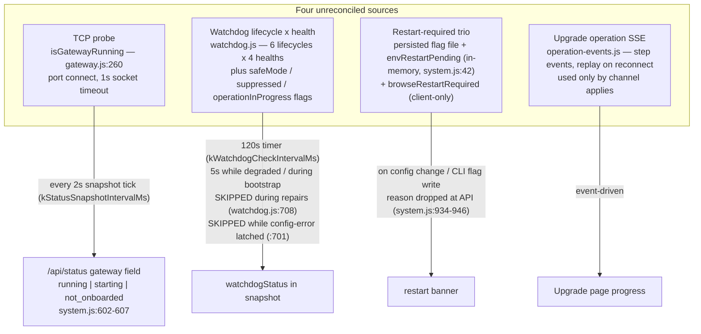
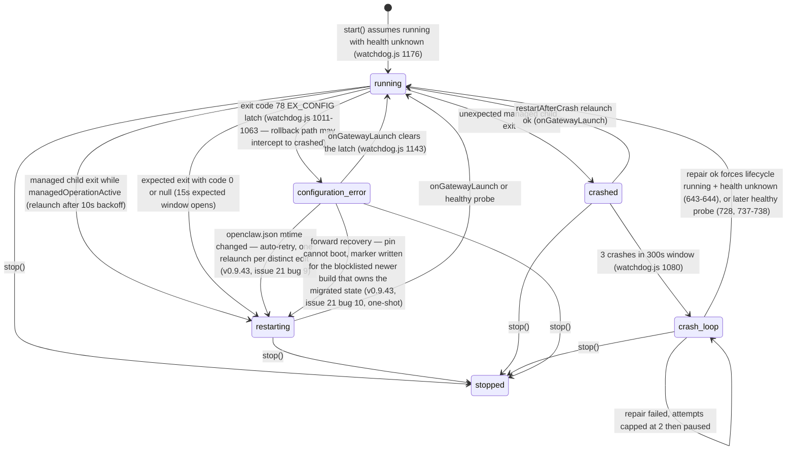
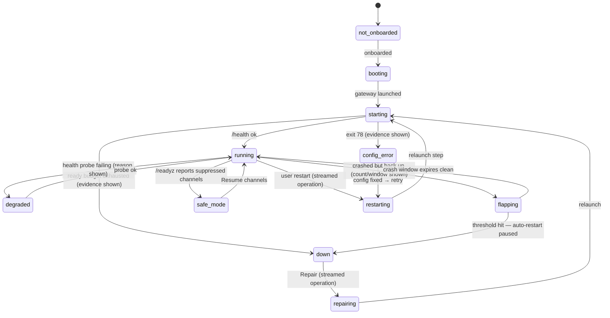
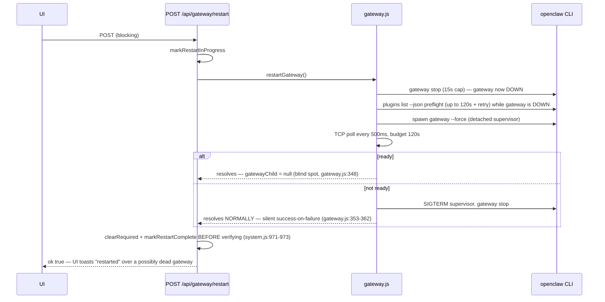
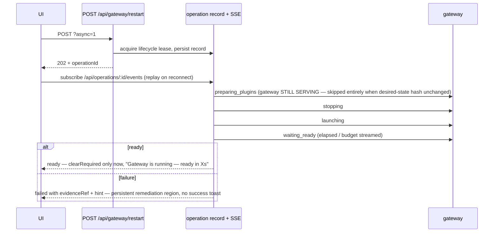

# Gateway State Model

> **Status (2026-08-29):** M2/M3 shipped in v0.9.37. The normative sections
> (§3–§10) describe what now runs; §2's "as-implemented, pre-M2" survey is
> historical. Known deviation from the §5 repair-lock matrix: manual repairs
> currently skip with HTTP 200 `{skipped:true}` instead of queueing — tracked
> in TODOS.md ("Manual repair should queue on the lifecycle lock, not skip").
> The plan file referenced below was a working artifact and does not ship in
> this repo.

Canonical reference for the AlphaClaw gateway state model: the as-implemented state sources (pre-M2), the target unified model (M2), and the restart pipeline (M3). Implementers of M2.2–M3.x and reviewers of those PRs read this file; the plan (`system-instruction-you-are-working-modular-turing.md`) is the approved source — where current code disagrees with the plan, the plan wins and the code is marked "current code:".

**Reading guide.** §2 is descriptive (what exists today, with file:line refs). §3–§10 are normative (what M2/M3 build). The State × UI matrix (§5) is the single source for UI labels, popovers, and notification copy. The precedence table (§4) is the reducer's contract; the reducer test matrix (M2.2) is generated from it.

---

## 2. Current state (as-implemented, pre-M2)

Four status sources exist. None reconciles with the others; each is "correct" per its own machine.



Known contradictions this produces (the screenshot bug): TCP says `running` (green, refreshed every 2s) while the watchdog says `crash_loop` (red, waiting for a 120s timer tick that is skipped while `operationInProgress`). Dead-but-onboarded reads as `starting` forever (`system.js:602-607` has no `down`).

### Watchdog machine as implemented

Lifecycle axis (`stopped | running | restarting | crashed | crash_loop | configuration_error`) and health axis (`unknown | healthy | degraded | unhealthy`) mutate together but are stored separately.



Current code (v0.9.39): the exit-78 branch consults the **gateway startup medic** (`gateway-medic.js`, default on via `updates.openclaw.medic.enabled`) after the rollback-eligibility check and before the incident settles. The watchdog enters `configuration_error`, then runs the medic under the gateway lifecycle lock (at most 2 attempts per incident, 5 runs per rolling hour across incidents); a successful repair transitions `configuration_error → restarting` and relaunches, and only when the medic is disabled, rate-limited, lock-contended, or out of remedies does the restart-paused latch notification fire. The diagram above predates the medic and shows only the direct latch path.

Current code (v0.9.43, issue #21): two more ways out of `configuration_error`. (1) **Auto-retry on config change** — every latch site records openclaw.json's mtime (`latchConfigError`); the latched health tick no longer bails blind but watches for a distinct new mtime (operator edit, medic fix, boot restore) and re-arms exactly one relaunch per edit (`maybeRetryAfterConfigChange`); another exit 78 re-latches with the new baseline, so it can never loop. (2) **Forward recovery** — when the PIN itself exits 78 (rollback-ineligible) and a NEWER blocklisted build with a local overlay exists whose blocklist reason implies it owns the migrated state (`config_error`/`config_migration_failed`), the ladder's last resort before the latch asks the channel layer to move FORWARD to it (`requestForwardRecovery`, one-shot via the persisted `forwardRecovery.attemptedId`; a second pin failure sets `noBootableVersion` and latches for good). The gateway card in `config_error` also surfaces the Repair action directly. Kill switches: `OPENCLAW_MIGRATION_GATE=off`, `OPENCLAW_FORWARD_RECOVERY=off`.

Health axis setters:

| health | set by |
|---|---|
| `unknown` | every launch/restart transition; repair success before verify |
| `healthy` | successful `/health` probe (`watchdog.js:737`) — also forces `lifecycle=running`, clears crash window |
| `degraded` | failed probe past 30s startup grace and 3-strike startup threshold (`watchdog.js:857`); starts the 5s degraded retry loop |
| `unhealthy` | crash/config-error exits; failed repair |

Defects to carry into M2 (all current code):

- **`onExpectedRestart()` is dead code** (`watchdog.js:1155-1165`). Nothing calls it; manual restarts never open the expected-restart suppression window, so probes during a restart read as real failures.
- **15s expected window vs 120s ready budget.** `kExpectedRestartWindowMs = 15s` (`watchdog.js:13`) but `waitForGatewayReady` budgets 120s (`gateway.js:43`). Even where the window *is* opened (expected exit path), it expires 8× before the restart budget, producing false `degraded` mid-restart — which can trip the channel-rollback hook (`watchdog.js:870-897`, 10-min degraded rollback).
- **Detached-supervision blind spot.** `runGatewayRestartCmd` discards the child on success (`gatewayChild = null`, `gateway.js:348`). After the first manual restart the watchdog owns no process: no exit events, so `crashed`/`crash_loop`/`configuration_error` transitions are unreachable until the next managed launch; `gatewayPid` is lost and uptime goes stale.
- **Probe skips.** `runHealthCheck` returns immediately while the config-error latch is set (`watchdog.js:701`) and while `operationInProgress` unless explicitly allowed (`:708`) — the exact moments the UI most needs fresh truth.

---

## 3. Target model — orthogonal axes, derived headline

Four independent axes; the headline is a pure derivation, never stored as opinion:

| axis | values | fed by |
|---|---|---|
| availability | `up` / `degraded` / `down` | shared TCP probe + `/health` probe results, each with `observedAt` |
| operation-in-flight | `none` / `restarting` / `repairing` / `applying` | gateway-lifecycle mutex lease + operation record |
| supervision | `managed` / `detached` | whether AlphaClaw owns a live child process |
| restart-required | `reasons[]` (coded) | unified restart-required store |

`GatewayState` enum (the derived headline): `not_onboarded | booting | starting | running | degraded | flapping | safe_mode | config_error | down | unknown`. Operations render as a badge/progress card alongside the headline, not as a fifth availability value. Restart-required renders as a banner, never a headline.



---

## 4. Deterministic precedence table

The reducer evaluates rows in order; the first true predicate wins. Every input carries `observedAt`. Constants reference `constants.js` names (M2 adds the `kState*` ones).

| # | state | predicate (all prior rows false) |
|---|---|---|
| 1 | `not_onboarded` | onboarding marker absent (`isOnboarded()` false, `gateway.js:209`). Local file read — never stale. |
| 2 | `booting` | `bootPhase !== "ready"` — the boot sequence holds the lifecycle mutex. `bootPhase === "failed"` → `booting(failed)` variant with the captured boot error as reason. |
| 3 | `unknown` (stale) | newest `observedAt` across {tcp, health, operation} older than `kStateStaleMs` (15s), or the snapshot compute error counter indicates consecutive failures. Server emits `unknown` at 15s; the **UI holds the last-known state with an "as of Xs ago" stamp for a further 30s grace**, then shows "Status unavailable". |
| 4 | `config_error` | config-error latch set: last observed gateway exit code == 78 (`kOpenclawConfigErrorExitCode`) and not since cleared by a successful launch or config-fix retry. Current code (v0.9.39): the startup medic (default on) runs first under the lifecycle lock and may clear the latch itself by repairing openclaw.json and relaunching (`runConfigMedic`, watchdog.js); `config_error` settles only after the medic is disabled, rate-limited, or exhausted (2 attempts/incident). Detached mode: latch only from evidence (stderr tail), labeled estimated. |
| 5 | `down` | `tcp.up === false` AND no active operation lease AND no relaunch pending — i.e. auto-restart paused (crash-loop threshold hit: `crashCountInWindow >= kWatchdogCrashLoopThreshold` (3)), repair attempts exhausted (`>= kWatchdogMaxRepairAttempts` (2)), or the last launch terminal-failed its ready budget. Reason carries last evidence + since. |
| 6 | operation-in-flight (badge) | active lifecycle-mutex lease with a live operation record. Headline while the lease is held: `starting` when the current step is `launching`/`waiting_ready` and elapsed < ready budget; otherwise the operation kind labels the badge (`restarting` / `repairing` / `applying`) over the last settled headline. Transient `tcp.down` during a leased operation is expected and does **not** fall to row 5. |
| 7 | `flapping` | `tcp.up === true` AND `1 <= crashCountInWindow < kWatchdogCrashLoopThreshold` (3) within `kWatchdogCrashLoopWindowMs` (300s). At the threshold auto-restart pauses and row 5 takes over. Detached mode: crash count is probe-inferred (§9) and labeled estimated. |
| 8 | `degraded` | `tcp.up === true` AND last `/health` probe failed or reported not-ok, past the 30s startup grace (`kHealthStartupGraceMs`) and the 3-strike startup threshold. Reason = probe error + `observedAt`. |
| 9 | `safe_mode` | `tcp.up === true` AND health ok AND `/readyz` reports suppressed channels. Reason = suppressed channel names. |
| 10 | `running` | `tcp.up === true` AND health ∈ {healthy, unknown-within-startup-grace} AND none of the above. |

Binding rules: exactly one primary action per state (§6); `restart-required.reasons[]` renders as banner regardless of headline; the headline never renders a raw enum name (§5 labels only).

---

## 5. State × UI matrix

**This table is the single source for UI labels, glossary popovers, AND notification copy.** Notifications draw from the same public-label map — no raw `crash_loop` in alerts.

| enum | UI label | dot | reason copy template | actions (primary first) |
|---|---|---|---|---|
| (no data yet) | "Connecting to AlphaClaw…" | gray | client-owned, only pre-first-frame | none; Restart disabled |
| not_onboarded | Not set up yet | gray | — | Set up |
| booting | AlphaClaw starting | cyan pulse | current phase | — |
| booting(failed) | Startup failed | red | error summary | **Retry** · View logs |
| starting | Starting | cyan pulse | "usually under 30s (0:34 / 2:00 max)"; past typical: "taking longer than usual" — no fake progress | View logs |
| running | Running | green steady | "up 3h 12m" | Restart |
| degraded | Running with issues | yellow steady | last probe error + observedAt | View logs · Restart |
| flapping | Unstable | red steady | "3 restarts detected in 5 min — up 40s" (+detail: "estimated — gateway runs outside AlphaClaw's supervision" when probe-inferred) | **Repair** · View logs · Roll back (confirm via `confirm-dialog.js`; only in stabilization window) |
| safe_mode | Channels paused | yellow steady | suppressed channel names | **Resume channels** |
| config_error | Configuration error | red steady | first redacted stderr lines | **View config error** · Retry · View logs |
| down | Down | red steady | reason + last evidence + since | **Retry** · Repair · View logs |
| unknown >30s | Status unavailable | gray hollow | "Last confirmed running 42s ago — reconnecting" | Refresh · View logs |
| staleness <30s | (keep last state) | subdued | "as of 12s ago" stamp | unchanged, Restart disabled |

### Dot / motion

| treatment | rule |
|---|---|
| pulse | **operation in progress only**: booting, starting, restarting, repairing |
| green steady | running — a healthy system doesn't animate |
| steady (yellow/red) | all settled states: degraded, flapping, safe_mode, config_error, down |
| gray hollow | unavailable (`unknown` past the 30s UI grace) |

One shared status-icon treatment (icon + text + color); error states carry an icon, never color alone. One global `prefers-reduced-motion` block covers all pulse keyframes.

### Glossary source table (one-liners for popovers + notifications)

| state | meaning (one line) | typical fix |
|---|---|---|
| Not set up yet | AlphaClaw hasn't completed onboarding | Run Set up |
| AlphaClaw starting | The AlphaClaw server itself is still booting | Wait; Retry if it fails |
| Starting | The gateway was launched and hasn't answered a health check yet | Wait up to 2 min; View logs if it stalls |
| Running | Port open and last health check passed | — |
| Running with issues | Port open but the health check is failing | View logs; Restart if it persists |
| Unstable | The gateway keeps crashing and being brought back | Repair; Roll back if a recent upgrade caused it |
| Channels paused | Gateway healthy but some channels are suppressed (safe mode) | Resume channels |
| Configuration error | The gateway refused to start because its config is invalid (exit 78) | View config error, fix the file, Retry |
| Down | The gateway is not running and automatic recovery has stopped | Retry; Repair |
| Status unavailable | AlphaClaw can't currently confirm gateway state | Refresh; check that AlphaClaw itself is reachable |

---

## 6. `actions[]` API contract

Each status frame's `state.actions[]` entry:

```
{ id, label, kind: "primary" | "secondary" | "danger", needsConfirm?, disabledReason?, description? }
```

- **Exactly one `kind:"primary"` per state**, bound in §4/§5 (bold entries).
- `description` = "what this does + expected duration"; rendered as the tooltip and as the confirm-dialog body when `needsConfirm` is set.
- `disabledReason` renders the action disabled with a tooltip (e.g. Restart while an operation badge shows).
- **The client renders, never derives.** The client-side label derivation in `components/gateway.js:31-68` is deleted in M2.2; the sole exception is the version-skew adapter rendering the legacy presentation when `state` is absent (old server).

---

## 7. Attach-vs-409 matrix — gateway lifecycle lock

One mutex serializes every gateway-mutating path. Lease deadline = operation-record expiry, force-released at `kGatewayLifecycleLeaseMs` (10 min, `constants.js:235`) with a process-tree kill; stale locks recovered at boot (records closed as "interrupted restart"). No cancellation or priorities in v1 — one operation at a time.

| requester | when idle | when another op active |
|---|---|---|
| User restart button | acquire-queue (new restart op) | active restart → **attach-to-existing** (return existing operationId); active repair/boot → **attach** (their relaunch is the outcome the user wants); active apply/rollback → **409-with-operationId** (mirrors `system.js` apply latch) |
| User repair button | acquire-queue | active repair → **attach**; active restart/boot → **acquire-queue** (repair does more than relaunch — runs after); active apply/rollback → **409-with-operationId** |
| Channel apply's restart step | runs under the apply's own lease (acquire-queue at apply start) | active restart/repair → **attach-to-existing** relaunch; conflicting apply → **409-with-operationId** |
| WhatsApp login restart | acquire-queue | active restart/repair/boot → **attach-to-existing**; active apply/rollback → **409-with-operationId** |
| Watchdog auto-restart timer | try-acquire (succeeds) | **try-acquire-skip** — logs an "operation in progress" watchdog event; a background loop never parks on a lock |
| Watchdog auto-repair timer | try-acquire (succeeds) | **try-acquire-skip** (logged) |
| Boot sequence | acquires and **holds the lock for the whole boot** (no boot-vs-API races) | n/a — boot runs first; it reconciles/closes any stale lease from a previous process |
| Rollback (channel hooks) | acquire-queue | active apply → **attach** (rollback is the apply's own failure path, same lease); active restart/repair → **acquire-queue** (runs after; supersedes further auto-restarts); conflicting rollback → **attach-to-existing** |

Conflict UX: Restart proactively disabled with `disabledReason` while any operation badge shows; a late 409 toasts "Another operation is running — attached to its progress" and attaches to the returned operationId's stream.

---

## 8. Restart sequence — current vs target

### Current (as-implemented)

Current code: `POST /api/gateway/restart` (`system.js:964-980`) → `restartGateway` → `runGatewayColdStart` (`gateway.js:364-368`). Pre-M1 every step was `execSync` (event loop frozen up to ~270s); M1.4 made them async but the ordering and silent-failure semantics are unchanged.



### Target (M3)

Prepare-first ordering (M3.1) + streamed operation (M3.2) + honest outcomes (M3.3). HTTP compat: **blocking semantics stay the default for one release**; `?async=1` → `202 { operationId }` streamed over the existing `/api/operations/:id/events` (replay on reconnect); default flips next minor. Internal `restartGateway()` promise semantics unchanged.



Step labels are human ("Checking plugins", "Stopping gateway", "Starting gateway", "Waiting for health check"); the skipped `preparing_plugins` step is not rendered. Concurrent restart POSTs return the existing operationId; restart during a channel apply → 409.

---

## 9. Supervision modes — detection documentation

| signal | managed child (AlphaClaw spawned it) | detached / supervisor mode (post-manual-restart today) |
|---|---|---|
| gateway death | **exit-based**: child `exit` event, immediate | **poll-based**: 10s always-on TCP watcher (M2.3) |
| exit codes / EX_CONFIG latch | exit-based, reliable (`onGatewayExit`, code 78 latch) | unavailable — inferred from log/stderr tail evidence only |
| crash-loop counting | exit-based (`crashTimestamps`, 3-in-300s) | **probe-inferred**: TCP down→up cycles counted as estimated crashes |
| health (wedged-but-TCP-up) | `/health` probe: 30s cadence while ≥1 SSE client connected, 120s baseline otherwise (env-tunable backstop); immediate debounced re-probes on TCP up/down transitions, on `waitForGatewayReady` success, and at every operation end (`allowDuringOperation: true, allowAutoRepair: false` — operation-end probes are resync-only: letting them start another repair would chain repair → probe → repair with no timer gap while the gateway is down; the mid-operation skip at `watchdog.js:708` stays) | same probe cadence — probes are the only signal |
| pid / uptime | child pid; uptime from launch | discovered pid via `notifyGatewayLaunch` where available; uptime resets on observed launch |

**Evidence honesty:** probe-inferred counts and attributions carry the label "estimated — gateway runs outside AlphaClaw's supervision" as a **detail line, never the headline**. Exit-code claims appear only for managed children.

**Re-ownership spike trigger:** if production-measured unified-state staleness p95 (real gateway death → state change) exceeds 15s after event-driven probes ship, schedule the child re-ownership spike (deferred item).

---

## 10. Temporal truth

- The reducer persists `{state, since, bootId}` **on transition only**; `since` never re-derives on read.
- Every input source carries its own `observedAt`; the reducer output includes per-source freshness.
- `unknown (stale)` at >15s input age is decided **server-side**; the UI adds its own 30s last-known grace ("as of 12s ago", subdued) before showing "Status unavailable".
- Elapsed/uptime is rendered **client-side** from `since` (reuse `formatDuration`) — frames never carry preformatted durations.
- Change detection for SSE frame suppression hashes a **semantic projection** that excludes timestamps and uptime, so identical states don't re-emit every tick; a ≥1 frame/10s heartbeat bounds client staleness detection.
- Boot reconciliation: on start, operation records from a previous `bootId` are closed as "interrupted restart" so a reconnecting UI always gets a terminal answer.
